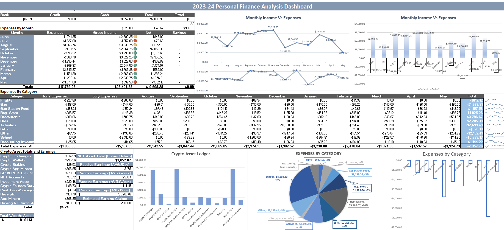

# Personal Finance Analysis Dashboard Excel (2022–2024)

This Excel-based project demonstrates my ability to organize, analyze, and present personal financial data across a two-year span (2022–2024). It combines traditional budgeting methods with digital income tracking, cryptocurrency holdings, and data visualization to showcase a broad understanding of personal finance and financial reporting.

> 📊 This dashboard was originally built for personal use but has been adapted with example data to demonstrate core skills in financial analysis, dashboard creation, and data organization.

---

## 📌 Project Objectives

- Track **active and passive income** from multiple traditional and digital sources
- Maintain a **categorized expense ledger** for spending awareness and budgeting
- Track **cryptocurrency holdings and earnings** across exchanges and wallets
- Evaluate **year-over-year net savings** and cash flow patterns
- Summarize performance through **interactive Excel dashboards**
- Bridge Excel workbooks into SQL-based reporting (in progress)

---

## 🛠 Tools & Skills Demonstrated

| Area              | Details |
|-------------------|---------|
| Software          | Microsoft Excel (transitioning into SQL) |
| Visualizations    | Time-series charts, pie charts, dashboards |
| Data Management   | Structured ledgers, multi-sheet setup, crypto pricing tables |
| Analysis Skills   | Categorization, ROI tracking, savings-rate evaluation |
| Financial Literacy| Income analysis, budgeting, crypto earnings, labor value |

---

## 📊 **Workbook Overview**

The Excel workbook consists of several interconnected sheets, each serving a specific role in the overall financial model.  

### **Dashboards**
- **2023–24 Portfolio Dashboard**  
  Year 2 summary: income vs expenses, crypto valuations, net worth changes, category breakdowns, and financial progress indicators.

- **2022–23 Portfolio Dashboard**  
  Year 1 summary: early financial behavior, income stability, spending categories, crypto tracking, and savings efficiency.

Both dashboards include:  
✔ Monthly income vs. expenses charts  
✔ Category spending aggregations  
✔ Crypto asset breakdown visuals  
✔ Net savings and financial trend summaries  

---

## 📁 **Ledger & Reference Sheets**

### **Expenses Ledger**  
Detailed categorized expense table including:  
- Dates, vendors, payment methods  
- Monthly rollups  
- Yearly totals by category  
(Not included in PDF preview or workbook)

### **Work Hours Ledger**  
Tracks hourly jobs across multiple roles to compute:  
- Earned income  
- Workload distribution  
- Annual comparisons  
(Not included in PDF preview or workbook)

### **Earning Claims**  
Logs income from:  
- Survey platforms  
- Apps and online earning sites  
- Freelancing microtasks  
Supports ROI evaluation and time-value analysis.

### **General Crypto Earnings**  
Tracks:  
- Staking rewards  
- Mining outputs (GPU, CPU, and app miners)  
- NFT-related income  
- Passive yield over daily, weekly, monthly, and yearly periods  

### **Crypto Ledger Wallet**  
Maintains balances for all crypto locations:  
- Exchanges (Coinbase, BinanceUS, Uphold, Kucoin, etc.)  
- Wallets (Metamask, Ronin, Gala Games, etc.)  
- Staking accounts  
- NFT assets with future-value estimation  
Detailed valuation and earnings metrics included.  

### **Crypto Market Price Reference**  
A snapshot of current coin prices used to dynamically calculate:  
- Total crypto wealth  
- Unrealized gains  
- Asset allocation  

---

## 🔑 **Key Insights Demonstrated**

This project highlights the ability to:  
- Design and structure a complete financial tracking system from raw data  
- Categorize expenses and income streams across multiple years  
- Build dashboards that summarize financial patterns and highlight key metrics  
- Track multi-source digital and traditional income  
- Integrate crypto assets, staking, NFTs, and passive income calculations  
- Produce business-ready reports for decision-making  

---

## 🚀 **Next Development Phase: SQL Migration (In Progress)**

The finance model is actively being migrated into a SQL schema to support:

- Automated expense categorization  
- Dynamic querying of income, spending, and crypto changes  
- Web/mobile dashboard output  
- Scalable database-backed financial analytics  

This step modernizes the Excel system into a data-engineering project while preserving all analytical logic.  

---

## 📸 Dashboard Previews

### 2023–24 Dashboard

### 2022–23 Dashboard

---

## 📂 Project Files

- **Excel Workbook:** [Personal-Finance-Analysis-Workbook.xlsx](Personal-Finance-Analysis-Workbook.xlsx)
- **Project Summary PDF:** [Personal-Finance-Portfolio-Summary.pdf](Personal-Finance-Portfolio-Summary.pdf)
